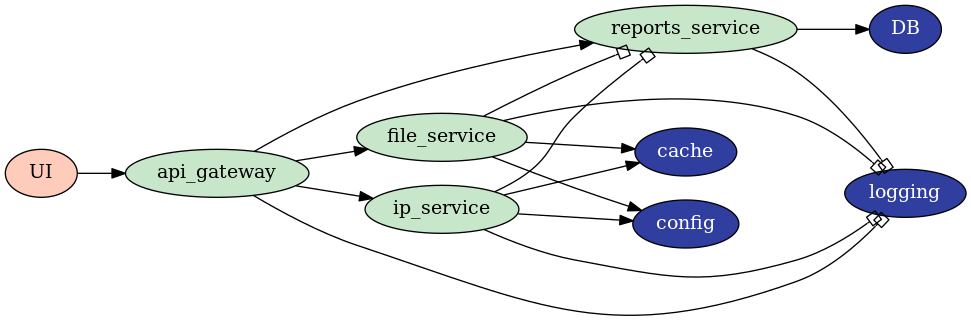

# microservices #

## Purpose
The goal for this project is to implement the Microservice Architecture for educational purpose (Hence, some design decisions might appear convoluted or unnecessary).

## Service
The implemented service has the following capabilities:
* Scan files for vulnerabilities
* Scan IPs for vulnerabilities

These functionalities will be extended as the project evolves.

## Architecture

