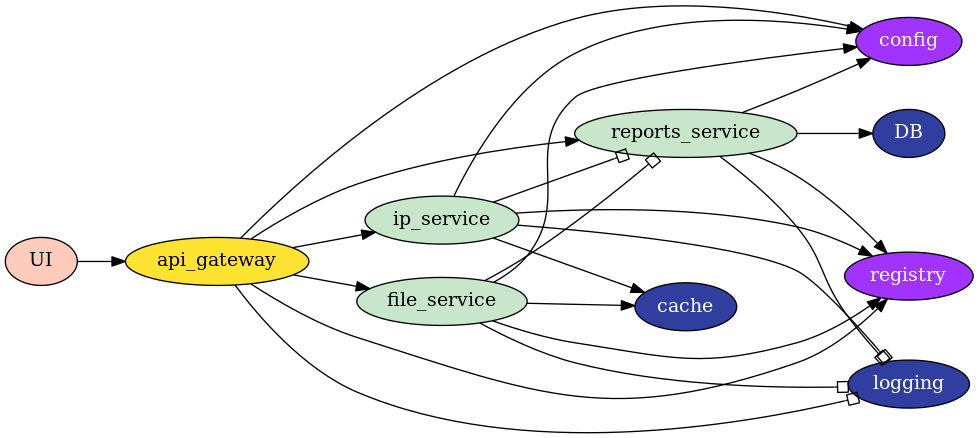

# threat.io #

## Purpose
The goal of this project is to implement the Microservice Architecture for educational purpose. Hence, some design decisions might appear convoluted or unnecessary. 

The following is a list of some of the concepts that will be implemented:
* Decoupled front-end (REACT)
* API gateways (Netflix Zuul reverse proxy)
* Centralized configuration
* Deployment (Docker)
* Synchronous & Asynchronous integration (REST, Kafka or RabbitMQ)
* Load balancer
* Service discovery (Netflix Eureka)
* Fault tolerance (Netflix Hystrix)
* Monitoring (Netflix Hystrix)
* Security (Netflix Zuul)
* Distributed caching (Redis)
* NoSQL database (MongoDB)
* Centralized Logging
* ...

## Service
The implemented service has the following capabilities:
* Scans files for vulnerabilities
* Scans IPs for vulnerabilities

These functionalities will be extended as the project evolves.

## Architecture


## Running
To start all services:
* run ```./dev.sh```
